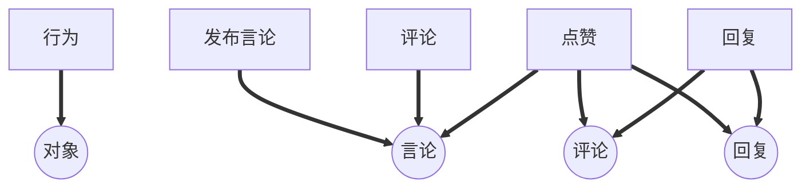
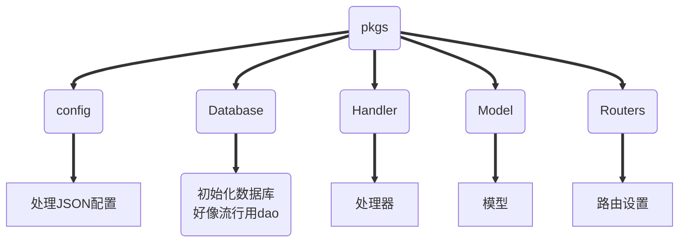

# 内容


> 知乎留言板。(实现评论、回复、点赞、发布言论等功能，5月22日截止)。

## 目录

> - [总览](#总览)
>
>     - [关系图解](#关系图解)
>
>     - [数据库设计](#数据库设计)
>
>     - [架构模式](#架构模式)
>
> - [模型](#模型)
>- [Message](#Message)
>     
>- [配置](#配置)
> 
>- [API列表](#API列表)
> - [访问主页](#访问主页)
>    
>     - [发布言论](#发布言论)
>     
>     - [评论](#评论)
>     
>     - [点赞](#点赞)
>     
>     - [回复](#回复)

## 总览

### 关系图解

> 额…虽然图是这么画的，不过在写代码的时候 评论和回复 都没有对象的限制




### 数据库设计

> 全搁在一个表里面

### 架构模式

> 额，好吧，我不知道属于哪类




## 模型

> 经过多次尝试最终决定存在一个表里面
>
> 也许是我太菜了吧。

### Message

```go
type Message struct{
    Like uint							  										//点赞数
    Content string	`gorm:"string not null",binding:"required"`						//内容
    ID uint								  										//自己的身份标识
    Pid uint							  										//上一级ID
    Kids []Message	`gorm:"-"`	 												 //子级
}
```

## 配置

```json
{
  "SqlName":"留言板",
  "SqlUserName": "root",
  "SqlUserPwd": "root",
  "SqlAddr":"127.0.0.1:3306",
  "Addr":"localhost:8080"
}
```

| KEY         | DESCRIPTION            |
| ----------- | ---------------------- |
| SqlName     | 数据库名               |
| SqlUserName | 数据库登录用用户名     |
| SqlUserPwd  | 数据库登录用用户名密码 |
| SqlAddr     | 数据库地址             |
| Addr        | 服务器地址             |


## API列表

### 访问主页

| 方法 | 路由 |
| :--: | :--: |
| GET  |      |

**Query Params**

| KEY  | VALUE | DESCRIPTION |
| :--: | :---: | :---------: |
| nil  |  nil  |     nil     |

**form-data**

| KEY  | VALUE | DESCRIPTION |
| :--: | :---: | :---------: |
| nil  |  nil  |     nil     |

### 发布言论

| 方法 |  路由   |
| :--: | :-----: |
| POST | publish |

**Query Params**

| KEY  | VALUE | DESCRIPTION |
| :--: | :---: | :---------: |
| nil  |  nil  |     nil     |

**form-data**

|   KEY   | VALUE  | DESCRIPTION |
| :-----: | :----: | :---------: |
| Content | string |  发言内容   |

> - - - - - - - - - - - - >

### 评论

| 方法 |  路由   |
| :--: | :-----: |
| POST | comment |

**Query Params**

| KEY  | VALUE | DESCRIPTION |
| :--: | :---: | :---------: |
| nil  |  nil  |     nil     |

**form-data**

|   KEY   | VALUE  | DESCRIPTION |
| :-----: | :----: | :---------: |
| Content | string | 评论的内容  |
|   Pid   |  uint  |    上级     |

> - - - - - - + - - - - - >

### 点赞

| 方法 | 路由 |
| :--: | :--: |
| POST | like |

**Query Params**

| KEY  | VALUE | DESCRIPTION |
| :--: | :---: | :---------: |
| nil  |  nil  |     nil     |

**form-data**

| KEY  | VALUE | DESCRIPTION |
| :--: | :---: | :---------: |
| Pid  | uint  |   上一级    |

> - - - - - - - - - - - - >

### 回复

| 方法 | 路由  |
| :--: | :---: |
| POST | reply |

**Query Params**

| KEY  | VALUE | DESCRIPTION |
| :--: | :---: | :---------: |
| nil  |  nil  |     nil     |

**form-data**

|   KEY   | VALUE  | DESCRIPTION |
| :-----: | :----: | :---------: |
|   Pid   |  uint  |   上一级    |
| Content | string | 回复的内容  |
