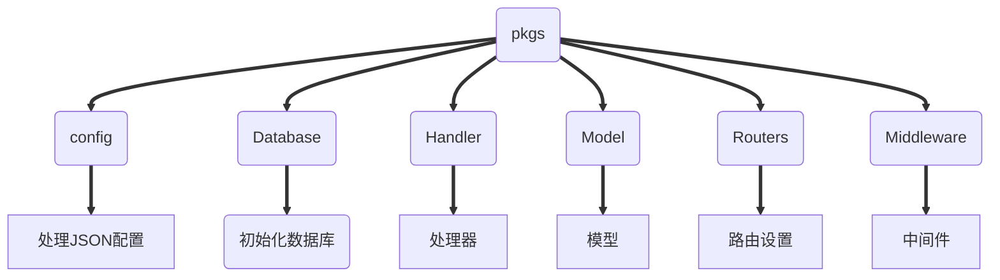

> 前情提要：由于某次阶段作业内容与考核作业类似，且有不同要求。由于已经实现了部分代码，于是有部分更改
>
> 详情查看[更该部分](#更改部分)

# 内容


> 知乎留言板。(实现评论、回复、点赞、发布言论等功能，5月22日截止)。

## 目录

> - [总览](#总览)
>     - [关系图解](#关系图解)
>     - [数据库设计](#数据库设计)
>     - [项目结构](#项目结构)
>     - [大致流程](#大致流程)
> - [模型](#模型)
> 	- [User](#User)
> 	- [Message](#Message)
> - [配置](#配置)
> - [API列表](#API列表)
> 	- [访问主页](#访问主页)
> 	
> 	- [发布言论](#发布言论)
> 	
> 	- [评论](#评论)
> 	
> 	- [点赞](#点赞)
> 	
> 	- [回复](#回复)
> 	
> 	- [注册](#注册)
> 	
> 	- [登录](#登录)
> 	
> - [不足](#不足)

## 总览

### 关系图解

```sequence
Title:模型间关系
用户->言论/评论/回复:发布(言论/评论/回复)
用户->言论/评论/回复:评论(言论/评论/回复)
用户->言论/评论/回复:赞一个(言论/评论/回复)
用户->言论/评论/回复:回复(言论/评论/回复)
Note left of 言论/评论/回复:(言论/评论/回复)使用同一个模型:Message
```

### 数据库设计

> 言论、评论、回复全搁在一个表里面
>
> 用户搁在另一个表里
>
> 这应该谈不上怎么设计吧(⊙o⊙)…

### 项目结构



### 大致流程

```mermaid
sequenceDiagram
	title:业务流程
	用户->home: 可直接访问
	Note right of home:home:<br>默认输出所有记录
	用户->login(登录):登录
	用户->register(注册):注册
	Note over home,register(注册):未登录
	islogin->publish(发布):发布想法
	islogin->comment(评论):评论
	islogin->like(赞):赞
	islogin->reply(回复):回复
	Note over publish(发布),reply(回复):已成功登录
	loop 登录校验
		用户-->islogin: 兄嘚，登录呀先！
	end
```

## 模型

### User

```go
type User struct {
	Uid int `gorm:"primaryKey"`
	Name string	`gorm:"string not null"`//用户名
	Pwd string `gorm:"string not null"`//用户密码
}
```

### Message

```go
type Message struct{
	Like int//点赞数
	Content string `gorm:"string not null" binding:"required"`//内容
	Mid int `gorm:"primaryKey" binding:"required`//自己的身份标识
	Pid int//上一级ID
	Kids []Message `sql:"-" gorm:"-"`//子级
	Uid int //归属的用户
}
```

## 配置

```json
{
  "SqlName":"留言板",
  "SqlUserName": "root",
  "SqlUserPwd": "root",
  "SqlAddr":"127.0.0.1:3306",
  "Addr":"localhost:8080"
}
```

| KEY         | DESCRIPTION            |
| ----------- | ---------------------- |
| SqlName     | 数据库名               |
| SqlUserName | 数据库登录用用户名     |
| SqlUserPwd  | 数据库登录用用户名密码 |
| SqlAddr     | 数据库地址             |
| Addr        | 服务器地址             |


## API列表

### 访问主页

| 方法 | 路由 |
| :--: | :--: |
| GET  |  /   |

**Query Params**

| KEY  | VALUE | DESCRIPTION |
| :--: | :---: | :---------: |
| nil  |  nil  |     nil     |

**form-data**

| KEY  | VALUE | DESCRIPTION |
| :--: | :---: | :---------: |
| nil  |  nil  |     nil     |

### 发布言论

| 方法 |   路由   |
| :--: | :------: |
| POST | /publish |

**Query Params**

| KEY  | VALUE | DESCRIPTION |
| :--: | :---: | :---------: |
| nil  |  nil  |     nil     |

**form-data**

|   KEY   | VALUE  | DESCRIPTION |
| :-----: | :----: | :---------: |
| Content | string |  发言内容   |

> - - - - - - - - - - - - >

### 评论

| 方法 |   路由   |
| :--: | :------: |
| POST | /comment |

**Query Params**

| KEY  | VALUE | DESCRIPTION |
| :--: | :---: | :---------: |
| nil  |  nil  |     nil     |

**form-data**

|   KEY   | VALUE  | DESCRIPTION |
| :-----: | :----: | :---------: |
| Content | string | 评论的内容  |
|   Pid   |  uint  |    上级     |

> - - - - - - + - - - - - >

### 点赞

| 方法 | 路由  |
| :--: | :---: |
| POST | /like |

**Query Params**

| KEY  | VALUE | DESCRIPTION |
| :--: | :---: | :---------: |
| nil  |  nil  |     nil     |

**form-data**

| KEY  | VALUE | DESCRIPTION |
| :--: | :---: | :---------: |
| Pid  | uint  |   上一级    |

> - - - - - - - - - - - - >

### 回复

| 方法 |  路由  |
| :--: | :----: |
| POST | /reply |

**Query Params**

| KEY  | VALUE | DESCRIPTION |
| :--: | :---: | :---------: |
| nil  |  nil  |     nil     |

**form-data**

|   KEY   | VALUE  | DESCRIPTION |
| :-----: | :----: | :---------: |
|   Pid   |  uint  |   上一级    |
| Content | string | 回复的内容  |

> - - - - - - + - - - - - >

### 注册

| 方法 |   路由    |
| :--: | :-------: |
| POST | /register |

**Query Params**

| KEY  | VALUE | DESCRIPTION |
| :--: | :---: | :---------: |
| nil  |  nil  |     nil     |

**form-data**

| KEY  | VALUE  | DESCRIPTION |
| :--: | :----: | :---------: |
| Pwd  | string |  用户密码   |
| Name | string |   用户名    |

> - - - - - - + - - - - - >

### 登录

| 方法 |  路由  |
| :--: | :----: |
| POST | /login |

**Query Params**

| KEY  | VALUE | DESCRIPTION |
| :--: | :---: | :---------: |
| nil  |  nil  |     nil     |

**form-data**

| KEY  | VALUE  | DESCRIPTION |
| :--: | :----: | :---------: |
|Uid|int|用户ID|
| Pwd  | string |  用户密码   |

## 不足

个人认为可能需要改进的地方

> 1.Query Params始终为空，应该是项目体量太小了
>
> 2.handler本身没有实现并发

## 更改部分

路径：

```
/Model/Message.go
/Model/User.go
/Middleware/*
/Handler/*
```

> 使用空接口来适配\*gorm.DB与\*sql.DB两种数据库

```
/main.go
```

> 声明了两种数据库供使用

```
/Database/InitSQL.go
```

> 使用原始接口

```
/Model/Message.go 128行
```

> 在使用gorm时可使用并发,如果使用原生接口则会由于链接过多而报错

吐槽一下：

> 原生接口的scan传入的参数的顺序应和 结构定义时的成员顺序一致/desc命令输出的一致